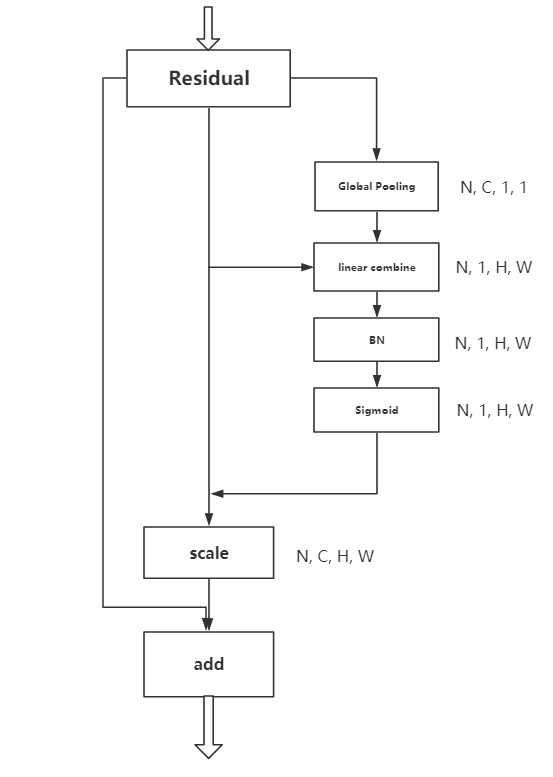

# Salient-Net, SENet 以及 ResNet 在 cifar10 和 cifar100 效果比较

## Salient-Block结构示意图及实现

示意图：


### 将Salient结构应用于ResNet中：



### Implement(Pytorch)：

```python
class SalientBlock(nn.Module):
    def __init__(self, in_planes):
        super(SalientBlock, self).__init__()
        self.globalAvgPool = nn.AdaptiveAvgPool2d(1)
        self.bn = nn.BatchNorm2d(1)
        self.sigmoid = nn.Sigmoid()
    
    def forward(self, x):
        size_n, _, size_h, size_w = list(x.size())
        w = self.globalAvgPool(x)
        w = torch.mean(w*x, 1).view((size_n, 1, size_h, size_w))
        spatial_w = self.sigmoid(self.bn(w))
        out = spatial_w * x
        return out
```

 ## Image Classification on CIFAR-10/100

We first conduct experiments on small datasets: CIFAR-10 and CIFAR-100. CIFAR-10 has 10 different classes, 6000 images per class, total about 50000 images as training data, 10000 images used for testing. 100 classes in CIFAR-100 dataset, 500 training images and 100 testing images per class. We train ResNet-50, SE-ResNet-50 and Salient-ResNet-50 on CIFAR-10 and CIFAR-100, report the top-1 and top-5 accuracy on the testing set.

Table.1 CIFAR-10

| Networks | CIFAR10 Top-1 Acc | Parameters (M) | GFLOPs |
|:-:|:-:|:-:|:-:|
| ResNet50 | 94.38% | 25.6 | 3.86 |
| SE-ResNet50(ratio=16) | 94.83% | 28.1 | 3.87 |
| Salient-ResNet50 | 94.91% | 25.6 | 3.87 |

Table.2 CIFAR-100

| Networks | CIFAR100 Top-1 Acc | Parameters (M) | GFLOPs |
|:-:|:-:|:-:|:-:|
| ResNet50 | 77.26% | 25.6 | 3.86 |
| SE-ResNet50(ratio=16) | 77.13% | 28.1 | 3.87 |
| Salient-ResNet50 | 78.35% | 25.6 | 3.87 |

## Image Classification on Imagenet-1K

In this experiment, we train networks on large dataset - ImageNet-2012-1K, this dataset comprise 1000 classes, 1300 images for training in each class, total 1.28 million training images and 50K images for validation. We report top-1 and top-5 accuracy on validation set.

Table.3

| Networks | Top-1 Acc | Top-5 Acc | Parameters (M) | GFLOPs |
|:-:|:-:|:-:|:-:|:-:|
| ResNet50 | 75.24% | 92.36% | 25.6 | 3.86 |
| SE-ResNet50(ratio=16) | 76.75% | 93.41% | 28.1 | 3.87 |
| Salient-ResNet50 | 76.61% | 93.29% | 25.6 | 3.87 |

## Salient-module in mobilenet

| Networks | Top-1 Acc | Top-5 Acc | Parameters (M) | GFLOPs |
|:-:|:-:|:-:|:-:|:-:|
| mobilenet-1.0 | 70.6% | - | 3.4 | 0.569 |
| SE-mobilenet-1.0(ratio=16) | 73.6% | 00.00% | 3.7 | 0.572 |
| Salient-mobilenet-1.0 | 73.3% | 91.4% | 3.4 | 0.573 |


