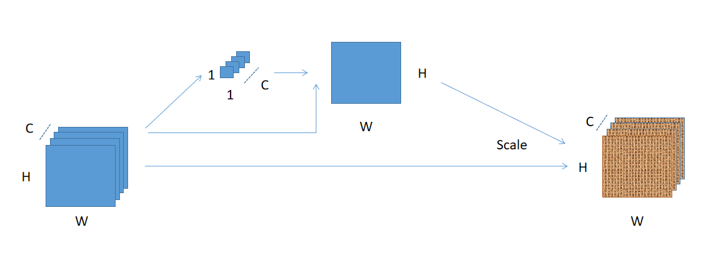
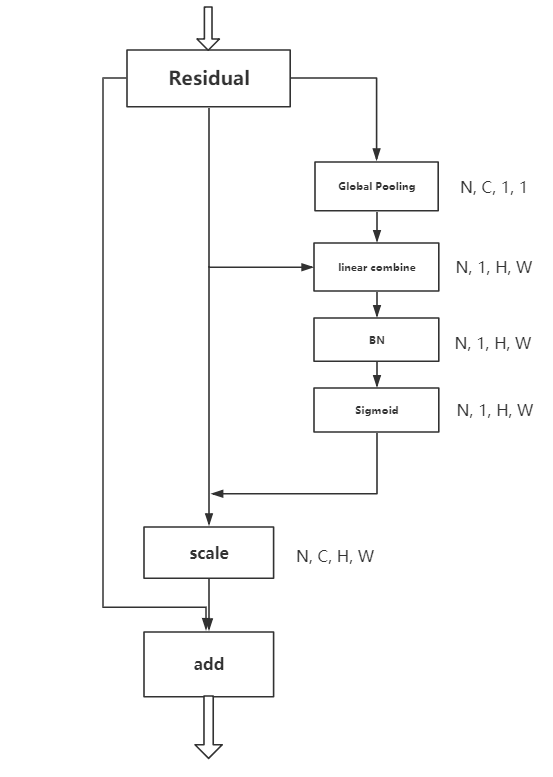

# 

[toc]

# SSANet: Squash and Spatial Attentation Networks

## Abstract

~~The CNN (convolutional neural networks) attract many attentation because of its great ability of feature self-extracting. CNN's central block, the convolutional operator can push networks to extract features which combine local spatial and channel-wise information. The main domain in CNN is how to help CNN learn better features. So research released VGG, Residual networks, DenseNet and so on for deeper features, and Squeeze-and-Excitation module (SE-module), Residual Attentation Networks to filtrate low-effect features and enhance high-effect features.~~

Aim to enhance CNN's representation ability with little parameter and computing cost, in this work we propose "Squash and Spatial Attentation (SSA)" module, which combine the channel-wise information and spatial information. The SSA-module is full-compatible with convolutional block, can be stacked in many CNN architectures forming like SSA-ResNet in Figure.4. Extensive experments are conducted on CIFAR-10, CIFAR-100 and Imagenet datasets to verify the effectiveness of SSANet. Our SSA-module can improve convolutional neural networks performance with nearly no parameters and low computing cost, the SSA-ResNet50 could archieve 76.60% (Top-1 Acc) in Imagenet1K, and 78.35% on CIFAR-100.

## 1. Introdction

Deep convolutional neural networks have proven to have great representation power for computer vision tasks. CNN can auto extract better features than manual designed, due to its central block, the convolutional operator can push networks to extract features which combine local spatial information. By stacking convlutional blocks, CNN can extract high-level features, and get better representations.

In the CNN's history, from LeNet, AlexNet to VGG and GoogleNet [2], the main development is that CNN has more and more layers or filters, in other word, CNN got deeper and wider. But after VGG, research found that CNN's performance get worse with more layers stacked in. CNN become hard to train since "gradient vanishing/exploding"[1], so Kaiming He introduced the Residual Networks in 2015, with the help of residual block, we could stack more and more layers in CNN for better performance, and the levels of features can be enriched by the number of stacked layers[1]. ~~After ResNet was released, researchers change the add operater in residual block to concate operator, and released "densely connected convolutional networks".~~

Different from stacking more layers, recent investigations have shown that the representations produced by CNNs can be strengthened by integrating attentation mechanisms into the network that help capture spatial or channel-wise correlations between features[4]. The attentation methods filtrate features by enhancing useful features and decreasing useless features. In CNN, the attentation methods include channel-wise and spatial attentation, the SENet modeling channel-wise relationship, SE-block is illustrated in Fig. 1. Spatial attentation is also saliency map, the standard architecture of spatial attentation is Residual Attentation Network[5]. Both of SENet and Residual Attentation Network have shortcomes, the SENet requires little computing cost, but many parameters, the Residual Attentation Network is special designed, not compatible with other CNN architectures.

In this paper, we introduce a new attentation unit - Squash and Spatial Attentation (SSA) module, which can combine the channel-wise and spatial-wise information. The SSA-module is proposed with the target of extracting better representations by low cost (few parameters, low computing cost) and full-compatibility with CNN architectures.

The SSA module is illustrated in Fig. 2, For the input X, we can obtain each feature map's globel information by Squash operation, e.g. global average pooling, which produces a channel descriptor by aggregating feature maps across their spatial dimensions (H × W) [4]. Then we regard the Squash operator's output as the weight or convlutional kernals of each channel in X, combining all channels together to get the saliency map. So the saliency map combine channel-wise and spatial-wise information, we resume the saliency map as the weight of all channel in X, recalibrate the input X by the saliency map.

The SSA-Module is designed to be compatible with other CNN architectures, so it is easily to stack after convlutional layers.

~~In the ImageNet-1K dataset, the ResNet50 integrated SSA-module, ~~

## 2. Related Works / Attentation Mechanisms

~~ ### 2.1 CNN architectures ~~

~~We have introduced that our SSA-Module is inspired with the target of improving CNN performance by low cost. In CNN architecture history, VGG and Inception Nets show that improving depth of a networks could extract better image representation. The residual network[1] demonstrated that it is possible to increase depth of CNNs to get better representation with the indentity mapping.~~

~~Another line of investigation has focused on methods to remain more information or filter less-important features in each layer of CNN. The typical example is attentation mechanisms, attentation mechanisms contain channel-wise and spatial correlations. Spatial attentation mechanism not only serves to select a focused location but also enhances different representations of objects at that location[5]~~

### 2.2 Channel-wise Attentation / Squash Operator

We consider each channel of feature map as a feature detector, channel-wise attentation produces a attentation map by exploiting the channel-wise relationship of feature map, pays attentation on each feature map's inportance for the vision task. For the input feature map with dimensions (C,H,W), their channel-wise attentation map is formed like (C,1,1), each parameter in C is a statistic, means the importance of its corresponding feature map for the task. To compute channel-wise attentation map efficiently, we should squash spatial dimensions of each feature map by special operators, e.g. global pooling. In Squeeze-and-Excitation module, we could konw that the global-average pooling achieve better performance than global-max pooling operator while both max and average pooling are effective, which mean the global-average pooling operator can produce better statistics of a feature map. So global-average pooling is a better choice in aggregation operators.

We can aggregate each feature map's spatial information as its flag or weight by global pooling operation, generate a channel-wise attentation map for input feature maps. We note this channel-wise attentation map as:

$$
caM = Squash(X), caM\in\mathbb{R}^{(C, 1, 1)}, X\in\mathbb{R}^{(C, H, W)}
$$

Where the X is the input feature map, caM is the channel-wise attentation map. In practice, "Squash" is global pooling operator.

### 2.3 Spatial Attentation / Salience map

Different from channel-wise attentation argument, the spatial attentation focuses on "where" are more informative in spatial dimensions, is complementary to the channel-wise attention. Corresponding to channel-wise attentation map, for input feature maps with dimensions (C, H, W), the spatial attentation map is formed like (1, H, W). Each parameter in spatial attentation map is the weight of corresponding features in all feature maps.

Inspired by the saliency map, the spatial attentation map can be produced by combining all channels of feature map. The simplest way is 
utilizing mean operation:

$$
meansaM = \frac{1}{C}\sum_{i=1}^{C}(X_{i,H,W})
$$

As this showing, each channel in feature maps is same important for task, this goes against the channel-wise attentation. So we can also assign each channel's weight to learn the spatial attentation map:

$$
saM = \sum_{i=1}^{C}(W_{i}\times X_{i,H,W})
$$

Where W is the weight vector of feature map, means each channel's importance for spatial attentation map.

## 3. Squash and Spatial Attentation modules

As the channel-wise and spatial attentation inspired, we can find that channel-wise attentation map is each channel's weight, and the spatial attentation map can be a linear combination of all channels. So we can combine both channel-wise and spatial attentation easily to produce a new attentation module, we call it "Squash and Spatial Attentation (SSA)" module.

SSA-module extract spatial and channel relationship by two steps.

1. Squash Operation
   
   for the input feature maps X with dimensions (C x H x W), we squash spatial information (H x W) to 1 dimension, the squash operator in our implement is global pooling, e.g. global average pooling. We resume this float could be flag or weight of which channel's features it belongs.

   $$
   caM = GlobalPooling(X), X\in\mathbb{R}^{(C, H, W)}
   $$

   $$
   caM_{i} = GlobalPooling(X_{i}),i\in\left \{1,2,...,C  \right \}
   $$

   $$
   caM\in\mathbb{R}^{(C, 1, 1)}
   $$

    Where the input X is the feature maps or output of a CNN's layers before residual operator. In SENet, we can find that the squash function: GlobalAvgPooling can get better flags/representations of spatial information than GlobalMaxPooling[4].

2. Spatial Attentation/Saliency Map
   
   we can get flags of each channel in X in step.1 by Squash operators, then we start to get saliency maps of input X with these flags, ~~we combine each channel by using these flags as the weights for each channels to get linear combination.~~ we combine all channels by their flags by squashing the feature map, we could get a feature map (1 x H x W) as saliency map for input X.

$$
saM=Sigmoid(BatchNorm(\sum_{i=1}^{C}(caM_{i}\times X_{i,H,W}))
$$

$$
saM\in\mathbb{R}^{(1, H, W)}
$$

After step.1 and step.2, we get a saliency map with channel-wise and spatial information, recalibrate or rescale the input X by the saliency map.

$$
Y = saM \times X
$$

$$
Y_{i,h,w} =saM_{1,h,w} \times X_{i,h,w}
$$

### 3.2 How to use SSA-module

The SSA-module is compatible with convolutional operation, it can be added after each convolutional layer in theory. But in practice, we only add it before the residual shortcut operator as illustrated in Figure.4.

## 4. Model and Computational Complexity

We design the SSA-module to improve CNN's representation ability with low parameter and computing cost. Different from Squeeze-and-Excitation module, we produce the channel-wise attentation map with out perceptrons or FC layers, we regard the vector squeezed by global pooling operator as channel-wise attentation map. So no extra parameter is needed in SSA-module.

As for computing cost of SSA-module, there are three main operators: squeeze operator, linear combination, and rescale. So its computational cost is inexpensive. We assume input image size is 224 x 224, and compare the forward computing cost ResNet-50 and SSA-ResNet-50, ResNet-50 requires about 3.86 GFLOPs, SSA-ResNet-50 requires about 3.87 GFLOPs, extra computational cost is lower than 0.3%

## 5. Experments

In this section, we perform several experments to evaluate effectiveness of SSA-Module in compurter vision tasks, and compatibility with CNN architectures.

### Image Classification on CIFAR-10/100

We first conduct experments on small datasets: CIFAR-10 and CIFAR-100. CIFAR-10 has 10 different classes, 6000 images per class, total about 50000 images as training data, 10000 images used for testing. 100 classes in CIFAR-100 dataset, 500 training images and 100 testing images per class. We train ResNet-50, SE-ResNet-50 and SSA-ResNet-50 on CIFAR-10 and CIFAR-100, report the top-1 and top-5 accuracy on the testing set.

Table.1 CIFAR-10

| Networks | CIFAR10 Top-1 Acc | Parameters (M) | GFLOPs |
|:-:|:-:|:-:|:-:|
| ResNet50 | 94.38% | 25.6 | 3.86 |
| SE-ResNet50(ratio=16) | 94.83% | 28.1 | 3.87 |
| SSA-ResNet50 | 78.35% | 25.6 | 3.87 |

Table.2 CIFAR-100

| Networks | CIFAR100 Top-1 Acc | Parameters (M) | GFLOPs |
|:-:|:-:|:-:|:-:|:-:|
| ResNet50 | 77.26% | 25.6 | 3.86 |
| SE-ResNet50(ratio=16) | 77.13% | 28.1 | 3.87 |
| SSA-ResNet50 | 78.35% | 25.6 | 3.87 |

### Image Classification on Imagenet-1K

In this experment, we train networks on large dataset - ImageNet-2012-1K, this dataset comprise 1000 classes, 1300 images for training in each class, total 1.28 million training images and 50K images for validation. We report top-1 and top-5 accuracy on validation set.

Table.3

| Networks | Top-1 Acc | Top-5 Acc | Parameters (M) | GFLOPs |
|:-:|:-:|:-:|:-:|:-:|
| ResNet50 | 75.24% | 92.36% | 25.6 | 3.86 |
| SE-ResNet50(ratio=16) | 76.75% | 93.41% | 28.1 | 3.87 |
| SSA-ResNet50 | 76.61% | 93.29% | 25.6 | 3.87 |

### SSA-module in mobielnet

In table.1 and table.2, SSA-module has shown great power to enhance representation ability of Residual Networks. In this experment, we verify its compatibility and enhancement.

We add SSA-module to mobilenet with width multiplier set to 1.0. We train SSA-movilenet-1.0 using same optimizing method with mobilenet in its official implement: RMSPropOptimizer with both decay and momentum set to 0.9, initial learning rate of 0.045, learning rate decay of 0.98 per epoch, total 400 epoches.

Table.4

| Networks | Top-1 Acc | Top-5 Acc | Parameters (M) | GFLOPs |
|:-:|:-:|:-:|:-:|:-:|
| mobielnet-1.0 | 70.6% | - | 3.4 | 0.569 |
| SE-mobielnet-1.0(ratio=16) | 00.0% | 00.00% | 3.7 | 0.572 |
| SSA-mobielnet-1.0 | 73.3%(预计) | 91.4% | 3.4 | 0.573 |

This table show SSA-module can help mobilenet to improve performance and is also compatible with lightweight networks.

## Conclusions and future work

We introduce a new lightweight attentation module - SSA-module to enhance CNN's representation, this module allow us to improve performance of CNN with little parameter and computing cost, and it is compatible with most CNN architectures.

But this module is also needed to re-train if we add it to CNN. In my sight, extra parameter of SSA-module is just in batch normalization layers, we can easily set the two parameters: gamma and beta of BN layer to constant value in CAFFE. So, can we improve CNN's performance by adding SSA-module to CNN straightly, i.e. setting the extra parameters of BN layers to constant values, without re-training? If this is feasible, this module can be a better choice for engineers to improve CNN's performance.

## Reference

[1]. He K, Zhang X, Ren S, et al. Deep Residual Learning for Image Recognition[C]// IEEE Conference on Computer Vision & Pattern Recognition. 2016.

[2]. Simonyan K , Zisserman A . Very Deep Convolutional Networks for Large-Scale Image Recognition[J]. Computer Science, 2014.

[3]. Li Da, Li Lin, Li Xiang. Classification of remote sensing images based on densely connected convolutional networks[J]. Computer Era, 2018.

[4]. Jie H, Li S, Albanie S, et al. Squeeze-and-Excitation Networks[J]. 2017, PP(99):1-1.

[5]. Wang F , Jiang M , Qian C , et al. Residual Attention Network for Image Classification[J]. 2017.

---

## Helps / 

The convolution operator, which enables networks to construct informative features by fusing both spatial and channel-wise information within local receptive fields at each layer.

investigate

Evidence from human perception process [23] shows the importance of attention mechanism, which uses top information to guide bottom-up feedforward process

[23] Mnih V , Heess N , Graves A , et al. Recurrent Models of Visual Attention[J]. Advances in neural information processing systems, 2014.
