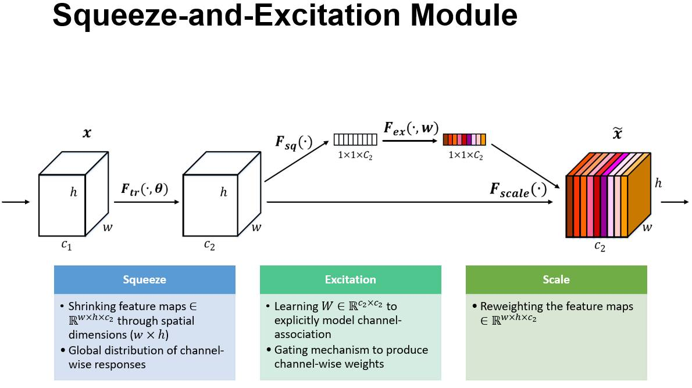

# 

[toc]

# SSANet: Squeeze and Spatial Attentation Networks

## Abstract

The CNN (convolutional neural networks) attract many attentation because of its great ability of feature self-extracting. CNN's central block, the convolutional operator can push networks to extract features which combine local spatial and channel-wise information. The main domain in CNN is how to help CNN learn better features. So research released VGG, Residual networks, DenseNet and so on for deeper features, and Squeeze-and-Excitation module (SE-module), Residual Attentation Networks to filtrate low-effect features and enhance high-effect features.

In this work, we propose "Squeeze and Spatial Attentation (SSA)" module, which combine the channel-wise information and spatial-wise information. We show that the SSA-block can be stacked in many CNN architectures forming SSANet. Extensive experments are conducted on CIFAR-10, CIFAR-100 and Imagenet datasets to verify the effectiveness of SSANet. Our SSA-module can improve convolutional neural networks performance with nearly no parameters and low computing cost, the SSA-ResNet50 could archieve 76.60% (Top-1 Acc) in Imagenet1K, and 78.35% on cifar-100.

## 1. Introdction

Deep convolutional neural networks have proven to have great representation power for computer vision tasks. CNN can auto extract better features than manual designed, due to its central block, the convolutional operator can push networks to extract features which combine local spatial information. By stacking convlutional blocks, CNN can extract high-level features, and get better representations.

In the CNN's history, from LeNet, AlexNet to VGG and GoogleNet [2], the main development is that CNN has more and more layers or filters, in other word, CNN got deeper and wider. But after VGG, research found that CNN's performance get worse with more layers stacked in. CNN become hard to train since "gradient vanishing/exploding"[1], so Kaiming He introduced the Residual Networks in 2015, with the help of residual block, we could stack more and more layers in CNN for better performance, and the levels of features can be enriched by the number of stacked layers[1]. ~~After ResNet was released, researchers change the add operater in residual block to concate operator, and released "densely connected convolutional networks".~~

Different from stacking more layers, recent investigations have shown that the representations produced by CNNs can be strengthened by integrating attentation mechanisms into the network that help capture spatial or channel-wise correlations between features[4]. The attentation methods filtrate features by enhancing useful features and decreasing useless features. In CNN, the attentation methods include channel-wise and spatial attentation, the SENet modeling channel-wise relatationship, SE-block is illustrated in Fig. 1. Spatial attentation is also saliency map, the standard architecture of spatial attentation is Residual Attentation Network[5]. Both of SENet and Residual Attentation Network have shortcomes, the SENet requires little computing cost, but many parameters, the Residual Attentation Network is special designed, not compatible with other CNN architectures.

In this paper, we introduce a new attentation unit - Squeeze and Spatial Attentation (SSA) Block, which can combine the channel-wise and spatial-wise information. The SSA-Block is proposed with the target of extracting better representations by low cost (few parameters, low computing cost) and fullly-compatibility with CNN architectures.

The SSA block is illustrated in Fig. 2, For the input X, we can obtain each feature map's globel information by squeeze operation, e.g. global average pooling, which produces a channel descriptor by aggregating feature maps across their spatial dimensions (H × W) [4]. Then we regard the squeeze operator's output as the weight or convlutional kernals of each channel in X, combining all channels together to get the saliency map. So the saliency map combine channel-wise and spatial-wise information, we resume the saliency map as the weight of all channel in X, recalibrate the input X by the saliency map.

The SSA-Module is designed to compatible with other CNN architecture, so it is easily to stack after  convlutional layers.

~~In the ImageNet-1K dataset, the ResNet50 integrated SSA-module, ~~

## 2. Related Works / Attentation Mechanisms

~~ ### 2.1 CNN architectures ~~

~~We have introduced that our SSA-Module is inspired with the target of improving CNN performance by low cost. In CNN architecture history, VGG and Inception Nets show that improving depth of a networks could extract better image representation. The residual network[1] demonstrated that it is possible to increase depth of CNNs to get better representation with the indentity mapping.~~

~~Another line of investigation has focused on methods to remain more information or filter less-important features in each layer of CNN. The typical example is attentation mechanisms, attentation mechanisms contain channel-wise and spatial correlations. Spatial attentation mechanism not only serves to select a focused location but also enhances different representations of objects at that location[5]~~

~~

### 2.2 SENet

The Squeeze-and-Excitation Networks first shown in 2017, They were used at ImageNet competition and helped to improve the result from last year by 25%.

### 2.3 Spatial Attentation / Salience map

The  Saliency Visualisation is proposed in

## 3. Squeeze and Spatial Attentation Blocks

SSA-Block extract spatial and channel relationship by two steps.

1. Squeeze
   
   for the input feature maps X with dimensions (C x H x W), we squash spatial information (H x W) to 1 dimension, the squash operator in our implement is global pooling, e.g. global average pooling. We resume this float could be flag or weight of which channel's features it belongs.

   $$
   seW = GlobalPool(X), X\in\mathbb{R}^{(C, H, W)}
   $$

   $$
   seW_{i} = mean/max(X_{i}),i\in\left \{1,2,...,C  \right \}
   $$

   $$
   seW\in\mathbb{R}^{(C, 1, 1)}
   $$

    The input X is the feature maps or output of a CNN's layers before residual operator. In SENet, we can find that the squash function: GlobalAvgPooling can get better flags/representations of spatial information than GlobalMaxPooling[4].

2. Spatial Attentation/Saliency Map
   
   we can get flags of each channel in X in step.1 by Squeeze operators, then we start to get saliency maps of input X with these flags, ~~we combine each channel by using these flags as the weights for each channels to get linear combination.~~ we combine all channels by their flags by squashing the feature map, we could get a feature map (1 x H x W) as saliency map for input X.

$$
saW=Sigmoid(BatchNorm(\sum_{i=1}^{C}(seW_{i}\times X_{i,H,W}))
$$

$$
saW\in\mathbb{R}^{(1, H, W)}
$$

After step.1 and step.2, we get a saliency map with channel-wise and spatial information, recalibrate or rescale the input X by the saliency map.

$$
Y = saW \times X
$$

$$
Y_{i,h,w} =saW_{1,h,w} \times X_{i,h,w}
$$

## 4. Model and Computational Complexity

## 5. Experments

### SSA-ResNet result on Imagenet1K

| Networks | Top-1 Acc | Top-5 Acc | Parameters (M) | FLOPs |
|:-:|:-:|:-:|:-:|:-:|
| SSA-ResNet50 | 76.61% | 93.29% | 25.6 | 3.87 |
| ResNet50 | 75.24% | 92.36% | 25.6 | 3.86 |
| SeNet50(ratio=16) | 76.75% | 93.41% | 28.1 | 3.87 |

### SSA-ResNet result on cifar

| Networks | cifar100 Top-1 Acc | cifar10 Top-1 Acc | Parameters (M) | FLOPs |
|:-:|:-:|:-:|:-:|:-:|
| SSA-ResNet50 | 78.35% | 94.93% | 25.6 | 3.87 |
| ResNet50 | 77.26% | 94.38% | 25.6 | 3.86 |
| SeNet50(ratio=16) | 77.13% | 94.83% | 28.1 | 3.87 |

## Reference

[1]. He K, Zhang X, Ren S, et al. Deep Residual Learning for Image Recognition[C]// IEEE Conference on Computer Vision & Pattern Recognition. 2016.

[2]. Simonyan K , Zisserman A . Very Deep Convolutional Networks for Large-Scale Image Recognition[J]. Computer Science, 2014.

[3]. Li Da, Li Lin, Li Xiang. Classification of remote sensing images based on densely connected convolutional networks[J]. Computer Era, 2018.

[4]. Jie H, Li S, Albanie S, et al. Squeeze-and-Excitation Networks[J]. 2017, PP(99):1-1.

[5]. Wang F , Jiang M , Qian C , et al. Residual Attention Network for Image Classification[J]. 2017.

---

## Helps

The convolution operator, which enables networks to construct informative features by fusing both spatial and channel-wise information within local receptive fields at each layer.

investigate

Evidence from human perception process [23] shows the importance of attention mechanism, which uses top information to guide bottom-up feedforward process

[23] Mnih V , Heess N , Graves A , et al. Recurrent Models of Visual Attention[J]. Advances in neural information processing systems, 2014.
