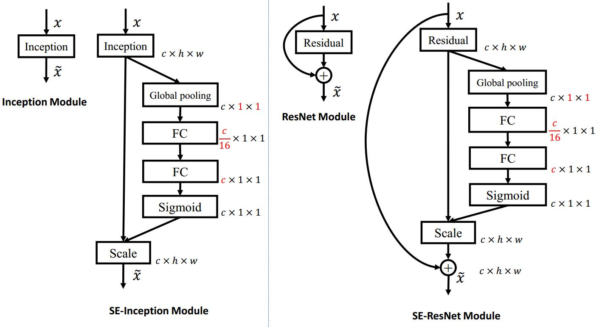
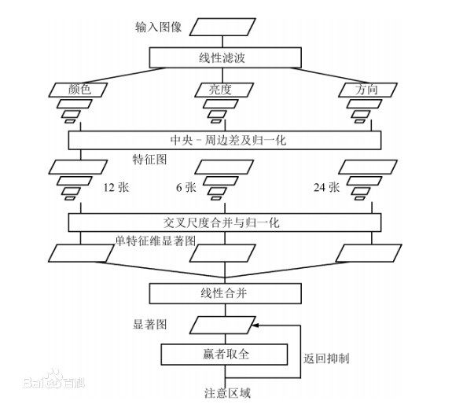

[TOC]


# Salient-Net

一种类似于SeNet那样的在ResNet上挂载一个网络挂件结构。

## ResNet


## SeNet

### SeBlock

本质上是给卷积后的每个feature map学习一个权重。

认为在每个卷积后的feature maps中，每个通道对于整个网络的重要性不同(可能是基于稀疏理论？)。


以上是SEBlock的结构，假设input的shape为(N, C, H, W)，其中N为batch_size， C为通道数，H和W分别为每个通道的图像的高和宽。通过Global_Pooling降维到(N, C, 1, 1)，再通过全连接层，学习到W=(N, C, 1, 1)，即为input的每个通道的权重，再将W数乘(broadcast_mult)到input中。




### 参数量和计算量分析

输入为input=(1, C, H, W)

参数量：C*C/8

计算量：C\*C/8 + C\*H*W


## Salient-Net

### 思想来源和启发(基于特征图融合的视觉显著性检测)

​		该部分摘抄自百度百科的[视觉显著性检测]([https://baike.baidu.com/item/%E8%A7%86%E8%A7%89%E6%98%BE%E8%91%97%E6%80%A7%E6%A3%80%E6%B5%8B](https://baike.baidu.com/item/视觉显著性检测))。

​		视觉显著性检测计算是指利用数学建模的方法模拟人的视觉注意机制，对视场中信息的重要程度进行计算。Treisman 等的特征集成理论为视觉显著性计算提供了理论基础，将视觉加工过程分为特征登记与特征整合阶段，在特征登记阶段并行地、独立地检测特征并编码，在特征整合阶段通过集中性注意对物体进行特征整合与定位。受特征集成理论的启发，Kock 和 Ullman最早提出了有关视觉注意机制的计算模型，通过滤波的方式得到特征，最后通过特征图加权得到显著图。

​		Itti于1998年提出基于显著性的视觉注意模型,并在2001年度Nature上对该模型理论作了进一步的完善。Itti的显著性模型最具代表性，该模型已经成为了自下而上视觉注意模型的标准。



对于一幅输入的图像，该模型提取初级视觉特征：颜色（RGBY）亮度和方位、在多种尺度下使用中央周边(Center-surround)操作产生体现显著性度量的特征图，将这些特征图合并得到最终的[显著图](https://baike.baidu.com/item/显著图/22742326)(Saliency map)后,利用生物学中赢者取全(Winner-take-all)的竞争机制得到图像中最显著的空间位置, 用来向导注意位置的选取，最后采用返回抑制 (Inhibition of return) 的方法来完成注意焦点的转移。

### Salient-Net的思想

Salient-Net的思想来源于传统计算机视觉中的图像显著性分析，对一张图像，学习三种特征图（亮度图，颜色图和SIFT特征图），再将这三种特征图进行加权求和，得到的特征图即为显著图(Salient-Map).

将这种思想应用到CNN中，我们就可以得到一种新的网络结构Salient-Block。

实际做法和SENet很像，都是在ResNet的shortcut之前加入一个小型结构，用于学习权重。

对比于Se-Block是学习到(N, C, 1, 1)作为每个通道(一个通道即一个特征图)的权重，Salient-Block是学习到(N, 1, H, W)作为所有通道每个像素的权重(通过1x1卷积，输出out_channels=1，即对每个通道加权求和)。

### 实现(Pytorch)：

```python
class SailentBlock(nn.Module):
    def __init__(self, in_planes):
        super(SailentBlock, self).__init__()
        self.conv = nn.Conv2d(in_planes, 1, kernel_size=1, stride=1, padding=0, bias=False)
        self.bn = nn.BatchNorm2d(1)
    
    def forward(self, x):
        w = F.sigmoid(self.bn(self.conv(x)))
        out = w * x # boradcasting multime
        return out
```


***参数量少***，相比于SE-Block的C\*C/8，Salient-Block只需要C\*1的参数量。对于32*\*32的输入图像，分别将Salient-Block和SE-block挂载于ResNet-50上，Salient-Net增加了3776个参数，而SE-Block增加了891136个参数。

​		相比于ResNet-50的模型大小约为90MB，加入了Salient-Block后模型大小增加100KB左右，而增加SE-Block后模型大小增加约10MB。

### 效果对比

在cifar-100上训练，batch_size均为100，学习率最开始为0.1，每过50个epoch学习率除以10。总共训练240个epoch。选取在测试集上的最大的ACC作为结果。

|                      | ResNet50 | SeNet50 | SalientNet50 |
| -------------------- | -------- | ------- | ------------ |
| cifar-100(Top-1 ACC) | 77.260%  | 77.130% | 78.350%      |
| cifar-10(Top-1 ACC)  | 94.380%  | 94.830% | 94.930%      |

